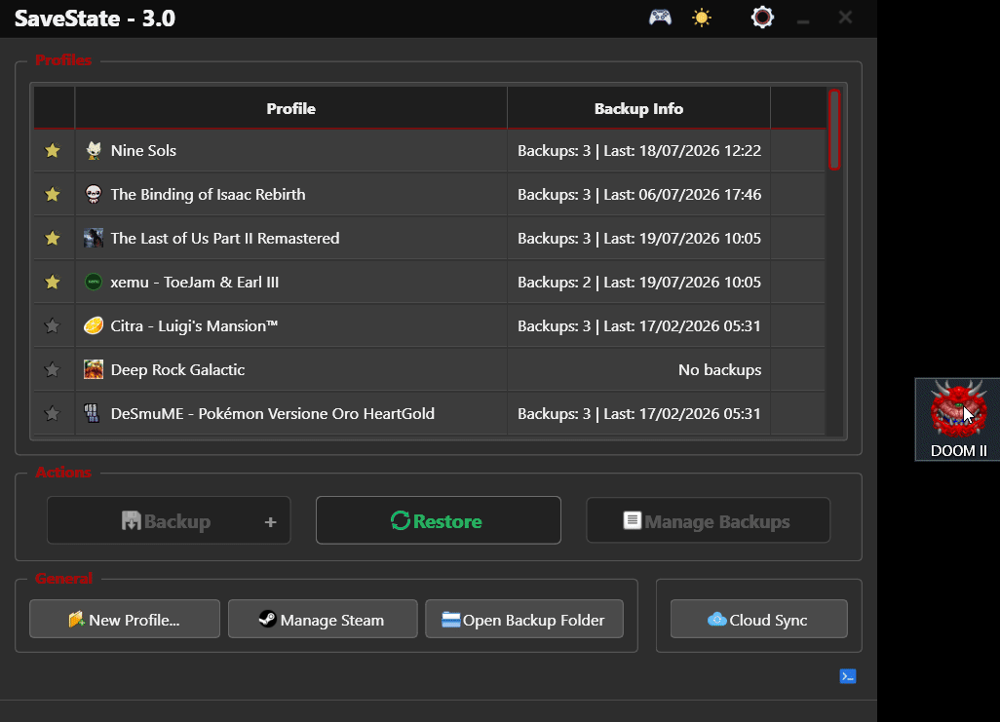

# SaveState

[](https://www.gnu.org/licenses/gpl-3.0)
[](https://github.com/Matteo842/SaveState/releases/latest)
[](https://github.com/Matteo842/SaveState/releases)
[](https://discord.gg/6d7Qv4hAky)
[](https://ko-fi.com/V7V61GBYAX)

A user-friendly GUI for **Windows** and **Linux** to back up and restore video game save files. Perfect for games without cloud saves, managing multiple save locations, or syncing progress across devices.

🖥️ **Looking for the Android/Mobile version?** Check out [SaveState for Android](https://github.com/Matteo842/SaveState-App)

> **Zero Configuration Required** — Download, run, and start backing up. No config files to edit, no setup wizard, no account needed. If a guide tells you to configure SaveState before using it, that guide is wrong.
>
> **No Admin Rights Needed** — This app does NOT require administrator privileges. If Windows asks you to run it as admin, **don't** — something is wrong.

**Add a game in one drag:** drop any launcher shortcut onto SaveState — it finds the save folder for you.



## Features

- **One-click backup & restore** with compressed `.zip` archives and automatic rotation
- **Drag & drop** from Steam, Epic, GOG, Battle.net, Ubisoft, EA App, Playnite, Heroic, and more
- **Smart save detection** — Steam awareness, deep scan, and fuzzy matching when paths aren't obvious
- **Cloud sync** (optional) — Google Drive, WebDAV, FTP/FTPS, SMB/NAS, or Git
- **Deep emulator support** — RetroArch, Dolphin, ares, and many more with guided setup where it helps
- **Per-profile settings**, minimize to tray, portable mode, and Linux AppImage

## Supported Emulators

SaveState automatically detects save data locations for a wide range of emulators:

| | | | |
|-------------|-------------|-------------|-------------|
| **RetroArch** ★ | Ryujinx | Yuzu | Rpcs3 |
| **Dolphin** ★ | **ares** ★ | DuckStation | PPSSPP |
| Citra | Azahar | mGBA | Snes9x |
| DeSmuME | Cemu | Flycast | ShadPs4 |
| SameBoy | PCSX2 \* | Xenia | Eden (yuzu) |
| melonDS | Gopher64 | Citron | Vita3K |
| Mednafen/Mednaffe | ymir | **xemu** † |  |

★ *Enhanced integration with guided setup*

---
\* PlayStation 2 memory card functionality in `SaveState` utilizes and adapts code from the [mymcplusplus](https://github.com/Adubbz/mymcplusplus) project, which is based on mymc+ by Florian Märkl and the original mymc by Ross Ridge. The mymcplusplus source code is distributed under the GNU General Public License v3.0. `SaveState`, including these derived components, is also licensed under GPLv3.

† Original Xbox (**xemu**) support uses a surgical QCOW2/FATX backup engine developed for this project. The research lab, method notes, and engine that made title-level extract/restore possible (including on HDDs where a game was never launched) are published separately as [**xemu_tools**](https://github.com/Matteo842/xemu_tools) by the same author ([Matteo842](https://github.com/Matteo842)).

---

## Install

**Windows (recommended)** — download `SaveState_vX.X.X_Win.zip` from [Releases](https://github.com/Matteo842/SaveState/releases/latest), extract, and run. No installer.

Or via WinGet:

```powershell
winget install Matteo842.SaveState
```

**Linux** — download `SaveState.tar.gz` from [Releases](https://github.com/Matteo842/SaveState/releases/latest), extract the AppImage, then:

```bash
chmod +x SaveState*.AppImage
./SaveState*.AppImage
```

**From source:** see [Building from Source](docs/Building-from-Source.md).

## Quick start

1. Launch the app — defaults work out of the box.
2. Drag a game shortcut onto the window (or use **Manage Steam** / **New Profile...**).
3. Select a profile → **Backup** / **Restore**.

Optional: Settings for backup folder, cloud sync, and per-profile limits. Right-click a profile for more options.

## Docs

More detail without bloating this page:

- [Usage](docs/Usage.md) — profiles, restore, launchers, UI screenshots
- [Cloud Sync](docs/Cloud-Sync.md) — providers and setup
- [How Save Search Works](docs/How-Save-Search-Works.md) — heuristics & flowchart
- [Building from Source](docs/Building-from-Source.md) — Python / dependencies

Feedback & ideas → [Issues](https://github.com/Matteo842/SaveState/issues). Code PRs are not accepted; see [CONTRIBUTING.md](CONTRIBUTING.md).

## 🔐 Code Signing & Security

This project is supported by the **SignPath Foundation** for free code signing.

[](https://signpath.org)

The artifact is signed by **SignPath.io** using a certificate from the SignPath Foundation.

## Legal

* [Privacy Policy](https://matteo842.github.io/SaveState/privacy.html)
* [Terms of Service](https://github.com/Matteo842/SaveState/blob/main/docs/TERMS.md)

## License

Distributed under the **GNU General Public License v3.0.** See the [`LICENSE`](https://www.gnu.org/licenses/gpl-3.0) file for more information.

---
[No time to fate, save your state!](https://www.youtube.com/@MrSujano)
