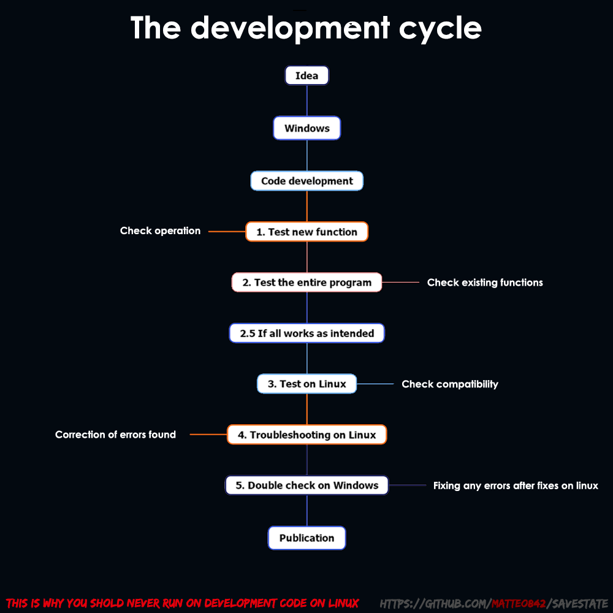

# SaveState

[](https://www.gnu.org/licenses/gpl-3.0)
[](https://github.com/Matteo842/SaveState/releases/latest)
[](https://github.com/Matteo842/SaveState/releases)
[](https://ko-fi.com/V7V61GBYAX)

A user-friendly GUI application for **Windows** and **Linux** to easily back up and restore video game save files. Perfect for games without cloud saves, managing multiple save locations, or syncing your progress across devices.


## About this Project

**SaveState** aims to prevent the frustration of losing your precious game progress due to corruption, accidental deletion, or system changes.

This tool offers a modern graphical interface for creating compressed backups of your game save files, managing multiple game profiles, syncing to the cloud, and restoring them whenever needed.

SaveState features automatic detection of Steam games, support for all major launchers via drag & drop, deep emulator integration, and now **cloud synchronization with Google Drive**.

---

## ✨ Key Features

### ☁️ Cloud Save (Google Drive Integration)

Sync your saves across devices with seamless Google Drive integration:
- **Upload, download, and sync** your backups to the cloud
- **Smart Sync Status** shows which files are synced, local-only, or need attention
- **Configurable auto-sync** with bandwidth limits and storage quotas


### 🛡️ Digitally Signed & Verified

SaveState is **officially signed via SignPath** — no more "Unknown Publisher" warnings or SmartScreen blocks on Windows. Install with confidence.

### 🎮 Universal Launcher Support

Works with **any PC game launcher** — not just Steam! Drag and drop executables or shortcuts from:
- Steam, Epic Games, GOG Galaxy, Battle.net, Ubisoft Connect, EA App, and more

### 🕹️ Deep RetroArch Integration

Full support for RetroArch with a streamlined setup:
- Detects your RetroArch installation and cores
- Guided setup to select a core and identify game/save files  
- Intelligent path resolution for saves (standard, XDG, Flatpak, Snap layouts)

### ⚙️ Per-Profile Backup Settings

Fine-tune backup behavior for each game individually:
- Override global settings for max backups, compression mode, max source size, and disk space checks

### 🐧 Linux AppImage & Portable Mode

- **AppImage**: Single file, no dependencies — just download, make executable, and run
- **Portable Mode**: Store all configs in your backup folder for USB drive usage

### 📦 Core Backup Features

- **One-click backup & restore** with compressed `.zip` archives
- **Automatic rotation** with configurable backup limits per profile
- **Direct restore from ZIP** — restore saves even without a profile
- **Data Safety**: Automatic configuration backups protect against corruption
- **Inline profile editing** via right-click context menu
- **Minimize to tray** for silent background auto-backups

### 🎯 Smart Save Detection

The detection engine is intelligent and thorough:
- **Deep Scan** recursively searches candidate directories when standard scan fails
- **Fuzzy Matching** handles abbreviated titles and naming variations
- **Steam Awareness** avoids false positives in Steam Userdata folders


## Visuals

**Drag & Drop from Any Launcher:**


## Supported Emulators

SaveState automatically detects save data locations for a wide range of emulators:

| | | | |
|-------------|-------------|-------------|-------------|
| **RetroArch** ★ | Ryujinx | Yuzu | Rpcs3 |
| **Dolphin** ★ | DuckStation | PPSSPP | Citra |
| Azahar | mGBA | Snes9x | DeSmuME |
| Cemu | Flycast | ShadPs4 | SameBoy |
| PCSX2 \* | Xenia | Eden (yuzu) | melonDS |
| Gopher64 | Citron | Vita3K | Mednafen/Mednaffe |
| ymir |  |  |  |

★ *Enhanced integration with guided setup*

---
\* PlayStation 2 memory card functionality in `SaveState` utilizes and adapts code from the [mymcplusplus](https://github.com/Adubbz/mymcplusplus) project, which is based on mymc+ by Florian Märkl and the original mymc by Ross Ridge. The mymcplusplus source code is distributed under the GNU General Public License v3.0. `SaveState`, including these derived components, is also licensed under GPLv3.

---

## How Save Search Works (Heuristics)

The following diagram illustrates the main steps that SaveState follows when attempting to locate a game's save folder:


**Log Console:**


## Getting Started

Get SaveState up and running on your system.

### Prerequisites

* **Operating System:** Windows (tested on Windows 10/11). Relies on Windows-specific libraries for shortcut handling.
* **Operating System:** Linux (tested on Ubuntu 24.x LTS)
* **Python:** Version 3.10 or higher recommended. (3.13 work fine)
* **Pip:** Python package installer (usually included with Python).

### Installation

**Option 1: Download Release (Recommended)**

**Windows**
1. Go to the [**Releases Page**](https://github.com/Matteo842/SaveState/releases/latest)
2. Download `SaveState_vX.X.X_Win.zip`
3. Extract and run — no installation required!

**Linux (AppImage)**
1. Go to the [**Releases Page**](https://github.com/Matteo842/SaveState/releases/latest)
2. Download `SaveState.tar.gz`
3. Extract the `.AppImage` file
4. Make it executable: `chmod +x SaveState*.AppImage`
5. Run it — no dependencies needed!

**Option 2: Running from Source (for development or advanced users)**

1.  Ensure you have Python 3.10+ and Git installed.
2.  Clone the repository:
    ```bash
    git clone [https://github.com/Matteo842/SaveState.git](https://github.com/Matteo842/SaveState.git)
    ```
3.  Navigate into the project directory:
    ```bash
    cd SaveState
    ```
4.  (Recommended) Create and activate a virtual environment:
    ```bash
    python -m venv venv
    # On Windows
    .\venv\Scripts\activate
    # On Linux/macOS
    source venv/bin/activate
    ```
5.  Install the required dependencies (see Dependencies section below):
    ```bash
    pip install -r requirements.txt
    ```
    *(Note: You need to create the `requirements.txt` file first!)*
6.  Run the application:
    ```bash
    python main.py
    ```

## Usage

1.  **Launch** `SaveState.exe` or run `python main.py`.
2.  **Configure Settings (Recommended on first launch):** Click the Settings button. Set your desired Base Backup Path where all backups will be stored in subfolders named after your profiles. Adjust other settings like max backups, Maximum source size, etc.
3.  **Add Profiles:**
    * **Manually:** Click New Manual Profile, enter a name, and provide the full path to the game's save folder.
    * **Steam:** Click Manage Steam Games. Select a detected game and click Configure Selected Profile. The app will try to guess the save path; confirm or provide it manually.
    * **Minecraft:** Click the Minecraft button. Select a world from the list and click OK. A profile will be created using the world name and its folder path.
    * **Drag & Drop:** Drag a game's `.lnk` shortcut file from your Desktop or elsewhere onto the main application window. The app will suggest a profile name and start searching for the save path; you'll be prompted to confirm or enter it manually.
    * **Multi Profile:** drop a `folder` containing multiple games on the main window. You can visualize all the profile of the folder and delete the profile you don't need. Then you can add all the profile to the list.
4.  **Manage Profiles:**
    * Select a profile in the list.
    * Click **Run Backup** to back it up.
    * Click **Restore from Backup** to restore from a previous backup.
    * Click **Manage Backup** to view and delete specific backup archives for that profile.
    * Click the **Shortcut Icon button** to create a shortcut on your Desktop for quick backups of that profile.
    * Click **Delete Profile** to remove the profile entry (this does not delete existing backup files).
5.  **Other Actions:**
    * Use **Open Backup Folder** to quickly open the base backup location in Explorer.
    * Double Click on a profile to **open** the **save path** in Explorer.
    * Toggle the **Log Console** visibility using the terminal icon button.
    * Toggle the **Theme** using the sun/moon icon button.

## Dependencies

This project relies on the following Python packages:

* **Required:**
    * [`PySide6`](https://pypi.org/project/PySide6/): For the graphical user interface (Qt for Python).
    * [`winshell`](https://pypi.org/project/winshell/): Used for reading `.lnk` shortcut files and finding special Windows folders like the Desktop.
    * [`pywin32`](https://pypi.org/project/pywin32/): A dependency for `winshell` (and used directly for creating shortcuts via COM). *(Note: Installation might sometimes require specific steps or precompiled binaries depending on your Python setup).*

* **Optional (for enhanced features):**
    * [`vdf`](https://pypi.org/project/vdf/): Used to parse Valve's VDF/ACF files to get more accurate Steam game names and library information. If not installed, Steam detection will still work but might use less precise names.
    * [`nbtlib`](https://pypi.org/project/nbtlib/): Used to read Minecraft's `level.dat` NBT files to get the actual world names. If not installed, the world's folder name will be used as the profile name instead.
    * [`thefuzz`](https://pypi.org/project/thefuzz/): It uses Levenshtein Distance to calculate the differences between sequences.

You can install all dependencies using pip. It is recommended to create a `requirements.txt` file with the following content:

```txt
PySide6
winshell
pywin32
vdf
nbtlib
thefuzz
```

And then run:
```txt
pip install -r requirements.txt
```

## Development



*(Screenshot: Development.png)*


---
[No time to fate, save your state!](https://www.youtube.com/@MrSujano)

---

## 🔐 Code Signing & Security

This project is supported by the **SignPath Foundation** for free code signing.

[](https://signpath.org)

The artifact is signed by **SignPath.io** using a certificate from the SignPath Foundation.

## Legal
* [Privacy Policy](https://matteo842.github.io/SaveState/privacy.html)
* [Terms of Service](https://github.com/Matteo842/SaveState/blob/main/TERMS.md)

## License

Distributed under the **GNU General Public License v3.0.** See the [`LICENSE`](https://www.gnu.org/licenses/gpl-3.0)file for more information.
