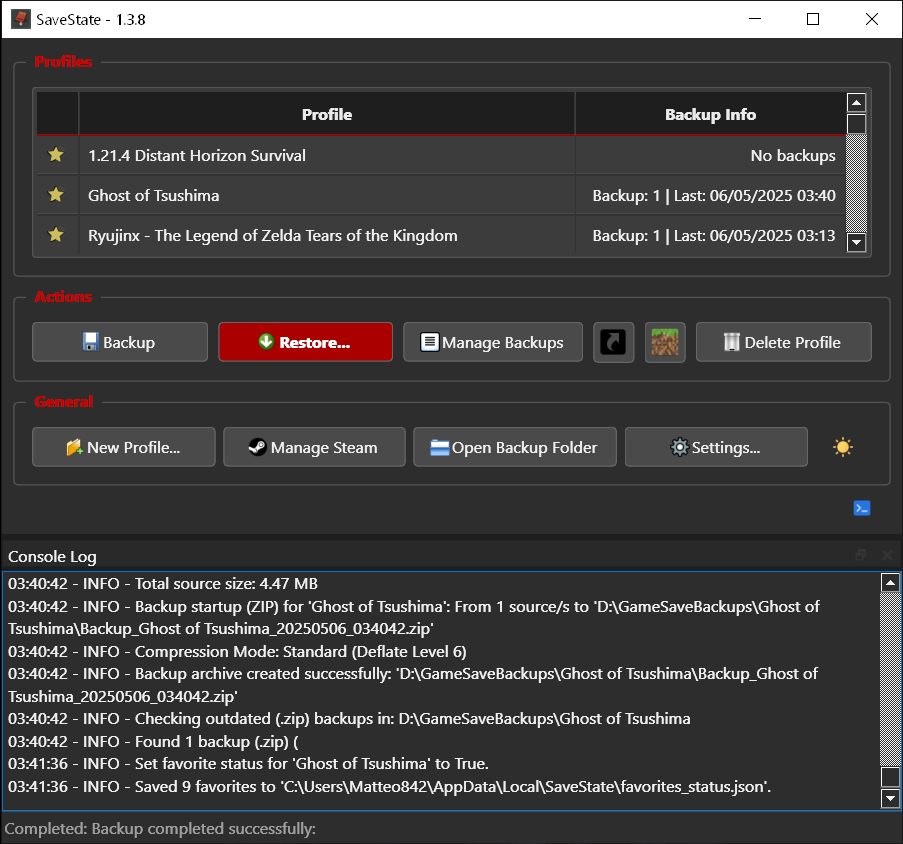

# SaveState

[](https://www.gnu.org/licenses/gpl-3.0)
[](https://github.com/Matteo842/SaveState/releases/latest)

A user-friendly GUI application for Windows to easily back up and restore video game save files, especially useful for games without cloud saves or for managing multiple save locations.


## About this Project

**SaveState** aims to prevent the frustration of losing your precious game progress due to corruption, accidental deletion, or system changes.

This tool offers a simple graphical user interface for creating compressed backups of your game save files and folders, managing multiple game profiles, and restoring them whenever needed.

Furthermore, SaveState features automatic detection of Steam games and even lets you generate profiles directly from Minecraft worlds or game shortcuts.

——————————————————————————————————————————————————

⚠️ Current Status (2025-05-6): This is a personal project currently **under active development.** 

——————————————————————————————————————————————————

## Features

* **Backup & Restore:** Perform compressed `.zip` backups for selected profiles with a single click. Restore from any available backup.
* **Automatic Backup Management:**
    * Configurable number of backups to keep per profile (automatically deletes the oldest).
    * Configurable backup compression level (Standard/Recommended, Maximum, or None/Stored).
    * Optional check for minimum free disk space on the backup drive before starting a backup.
    * Optional check for maximum source folder size to prevent accidental backup of huge folders.
* **Steam Integration:**
    * Scans for Steam installation and libraries.
    * Automatically detects installed Steam games.
    * Attempts to identify the correct Steam User ID (resolving profile names if the optional `vdf` library is installed).
    * Suggests save game paths based on Steam UserData conventions.
    * Configure backup profiles for Steam games directly from the detected list.
* **Drag & Drop Profile Creation:** Drag a game's shortcut (`.lnk` file) onto the main window to automatically extract the game name and installation path, then initiates a background search for the save location.
* **Manual Profile Creation:** Easily add any game by specifying a profile name and the path to its save folder.
* **Minecraft Java Edition Support:**
    * Automatically locates the default `.minecraft/saves` folder.
    * Lists all installed worlds, reading the world name from `level.dat` if the optional `nbtlib` library is present (falls back to folder name otherwise).
    * Create backup profiles directly from the detected world list.
* **Desktop Shortcut Creation:** Create `.lnk` shortcuts on your desktop for specific profiles. Clicking the shortcut runs a silent backup for that profile using `backup_runner.py` and shows a desktop notification.
* **Emulator Support (Experimental):**
    * Automatic detection and profile creation for supported emulators' save data.
* **User Interface:**
    * Clean and simple graphical interface built with PySide6.
    * Switchable Dark and Light themes.
    * Profile list showing name and basic backup info (count, last backup date).
    * Settings dialog to configure paths, limits, theme, language, and more.
    * Dockable Log Console displaying detailed operation status and errors.
    * Basic internationalization support (Italian/English currently included).
* **No Administrator Privileges Required**
* **Portable:** Runs directly from the `.exe` file without installation.

## Visuals

**Drag & Drop Shortcut for Profile Creation:**


## Supported Emulators

SaveState includes experimental support for automatically detecting save data locations for certain emulators, simplifying the profile creation process.

**Currently Supported in version 1.3.9:**

*   **Ryujinx**
*   **yuzu**
*   **rpcs3**
*   **DuckStation**
*   **Dolphin**
*   **PPSSPP**
*   **citra**
*   **Azahar**
*   **mGBA**
*   **snes9x**
*   **DeSmuME**
*   **Cemu**
*   **flycast**


## How Save Search Works (Heuristics)

The following diagram illustrates the main steps that SaveState follows when attempting to locate a game's save folder:


**Log Console:**


## Getting Started

Get SaveState up and running on your system.

### Prerequisites

* **Operating System:** Windows (tested on Windows 10/11). Relies on Windows-specific libraries for shortcut handling.
* **Python:** Version 3.10 or higher recommended.
* **Pip:** Python package installer (usually included with Python).

### Installation

**Option 1: Using the Release (Recommended for most users)**

1.  Go to the [**Releases Page**](https://github.com/Matteo842/SaveState/releases/latest) on GitHub.
2.  Download the `SaveState.exe` file from the latest release assets.
3.  Place `SaveState.exe` in any folder you like and simply run it. No installation required!

**Option 2: Running from Source (for development or advanced users)**

1.  Ensure you have Python 3.10+ and Git installed.
2.  Clone the repository:
    ```bash
    git clone [https://github.com/Matteo842/SaveState.git](https://github.com/Matteo842/SaveState.git)
    ```
3.  Navigate into the project directory:
    ```bash
    cd SaveState
    ```
4.  (Recommended) Create and activate a virtual environment:
    ```bash
    python -m venv venv
    .\venv\Scripts\activate
    ```
5.  Install the required dependencies (see Dependencies section below):
    ```bash
    pip install -r requirements.txt
    ```
    *(Note: You need to create the `requirements.txt` file first!)*
6.  Run the application:
    ```bash
    python main.py
    ```

## Usage

1.  **Launch** `SaveState.exe` or run `python main.py`.
2.  **Configure Settings (Recommended on first launch):** Click the Settings button. Set your desired Base Backup Path where all backups will be stored in subfolders named after your profiles. Adjust other settings like max backups, theme, language, etc.
3.  **Add Profiles:**
    * **Manually:** Click New Manual Profile, enter a name, and provide the full path to the game's save folder.
    * **Steam:** Click Manage Steam Games. Select a detected game and click Configure Selected Profile. The app will try to guess the save path; confirm or provide it manually.
    * **Minecraft:** Click the Minecraft button. Select a world from the list and click OK. A profile will be created using the world name and its folder path.
    * **Drag & Drop:** Drag a game's `.lnk` shortcut file from your Desktop or elsewhere onto the main application window. The app will suggest a profile name and start searching for the save path; you'll be prompted to confirm or enter it manually.
4.  **Manage Profiles:**
    * Select a profile in the list.
    * Click **Run Backup** to back it up.
    * Click **Restore from Backup** to restore from a previous backup.
    * Click **Manage Backup** to view and delete specific backup archives for that profile.
    * Click the **Shortcut Icon button** to create a shortcut on your Desktop for quick backups of that profile.
    * Click **Delete Profile** to remove the profile entry (this does not delete existing backup files).
5.  **Other Actions:**
    * Use **Open Backup Folder** to quickly open the base backup location in Explorer.
    * Toggle the **Log Console** visibility using the terminal icon button.
    * Toggle the **Theme** using the sun/moon icon button.

## Dependencies

This project relies on the following Python packages:

* **Required:**
    * [`PySide6`](https://pypi.org/project/PySide6/): For the graphical user interface (Qt for Python).
    * [`winshell`](https://pypi.org/project/winshell/): Used for reading `.lnk` shortcut files and finding special Windows folders like the Desktop.
    * [`pywin32`](https://pypi.org/project/pywin32/): A dependency for `winshell` (and used directly for creating shortcuts via COM). *(Note: Installation might sometimes require specific steps or precompiled binaries depending on your Python setup).*

* **Optional (for enhanced features):**
    * [`vdf`](https://pypi.org/project/vdf/): Used to parse Valve's VDF/ACF files to get more accurate Steam game names and library information. If not installed, Steam detection will still work but might use less precise names.
    * [`nbtlib`](https://pypi.org/project/nbtlib/): Used to read Minecraft's `level.dat` NBT files to get the actual world names. If not installed, the world's folder name will be used as the profile name instead.
    *  [`thefuzz`]((https://github.com/seatgeek/thefuzz)): It uses Levenshtein Distance to calculate the differences between sequences.

You can install all dependencies using pip. It is recommended to create a `requirements.txt` file with the following content:

```txt
PySide6
winshell
pywin32
vdf
nbtlib
thefuzz
```

And then run:
```txt
pip install -r requirements.txt
```

## Development Tools

### SaveState Tool (Helper GUI)

To aid in the development process, particularly with managing translations and creating application packages, a dedicated helper tool with a graphical interface is available within the project repository.


*(Screenshot: SaveStateTools.png)*

This tool provides a user-friendly way to perform common development tasks without directly using the command line:

* **Translation Management:**
    * Run `pyside6-lupdate` (or standard `lupdate`) to scan the configured Python source files and update the `.ts` translation file (`SaveState_en.ts` by default) with new or changed translatable strings.
    * Run `pyside6-lrelease` to compile the `.ts` file into the binary `.qm` format required by the application.
* **Application Packaging:**
    * Run `PyInstaller` to package the SaveState application for distribution.
    * Allows choosing between **One-File** mode (using `SaveState-OneFile.spec`) or **One-Folder** mode (using command-line arguments).
* **Integrated Output:** Displays the real-time output from `lupdate`, `lrelease`, and `PyInstaller` directly within the tool's log window.
* **Configuration:** Saves its own settings (paths to Qt tools, source file lists) persistently.

**To Use:**

1.  Ensure you have the necessary dependencies installed (`PySide6`, `PyInstaller`, and the Qt SDK containing `lupdate`/`lrelease` accessible in your system or configured in the tool's settings).
2.  Locate the tool's script (e.g., `SaveStateTool.py` or `Update_Translation.py` - *rename it consistently!*) within the repository. It's recommended to run it from the **root directory** of the SaveState project.
3.  Run it using `python path/to/your_tool_script.py`.
4.  Use the buttons to update translations, create `.qm` files, or build the application package.

*(This tool itself requires PySide6 to run).*

## License

Distributed under the **GNU General Public License v3.0.** See the [`LICENSE`](https://www.gnu.org/licenses/gpl-3.0)file for more information.
