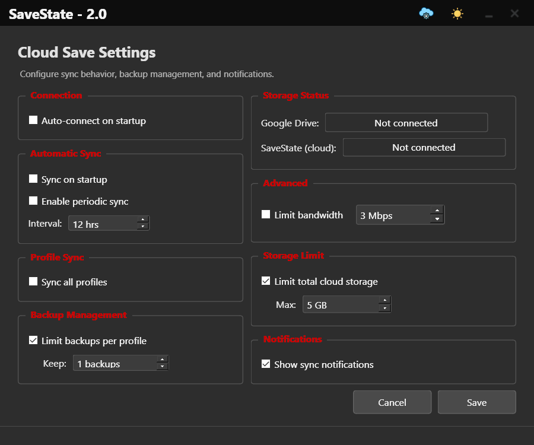

# Cloud Sync

Optional sync of your backups across devices. Nothing is uploaded unless you configure a provider.

## Providers

| Provider | Description |
|----------|-------------|
| **Google Drive** | Full OAuth2 integration with your Google account |
| **WebDAV** | Any WebDAV server (Nextcloud, ownCloud, etc.) |
| **FTP/FTPS** | Traditional FTP with optional TLS/SSL encryption |
| **SMB/Network Folder** | Windows network shares and NAS devices |
| **Git** | Local Git repository with optional push/pull to GitHub, GitLab, etc. |

## What you get

- **Upload, download, and sync** backups to the cloud
- **Smart Sync Status** — synced, local-only, or needs attention
- **Configurable auto-sync** with bandwidth limits and storage quotas
- Dedicated setup dialogs for each provider

Open **Cloud Sync** from the main window after install — configuration is optional and never required to use local backups.
