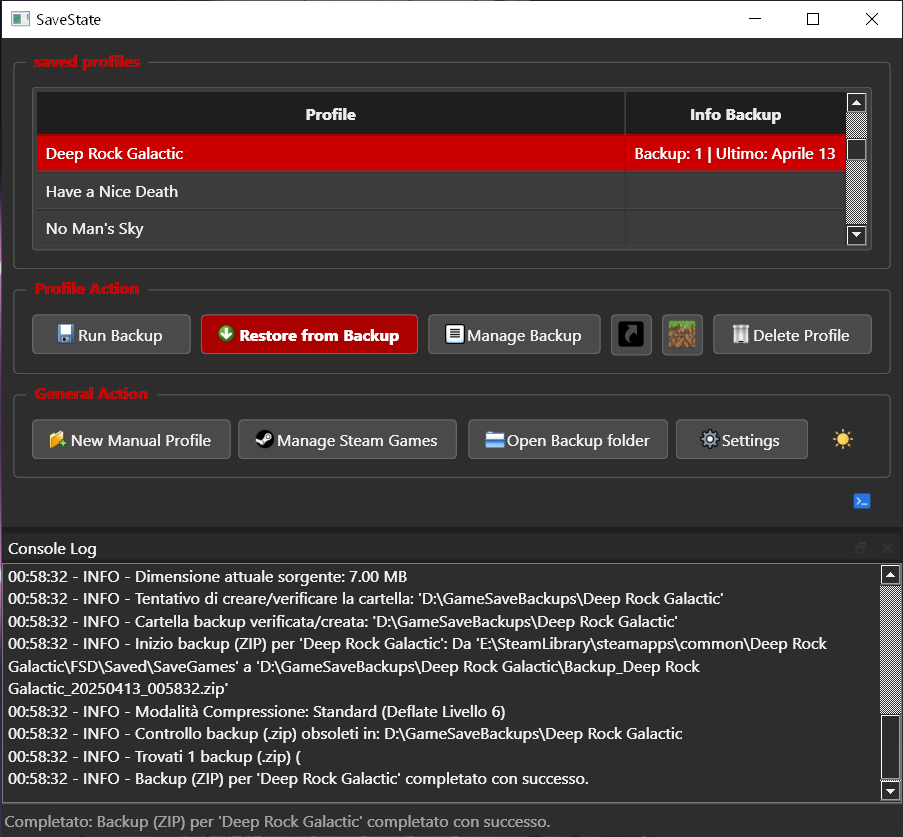

# How Save Search Works

When you add a game (drag & drop, Steam, or manual), SaveState tries to locate the save folder automatically.

## Heuristics overview

The detection engine is thorough:

- **Deep Scan** — recursively searches candidate directories when a standard scan fails
- **Fuzzy Matching** — handles abbreviated titles and naming variations
- **Steam Awareness** — avoids false positives in Steam Userdata folders

Flow of the main steps:

## Log Console

If detection fails or looks wrong, open the Log Console (terminal icon) to see what SaveState tried:

You can always fall back to **New Profile...** and paste the save path manually.
