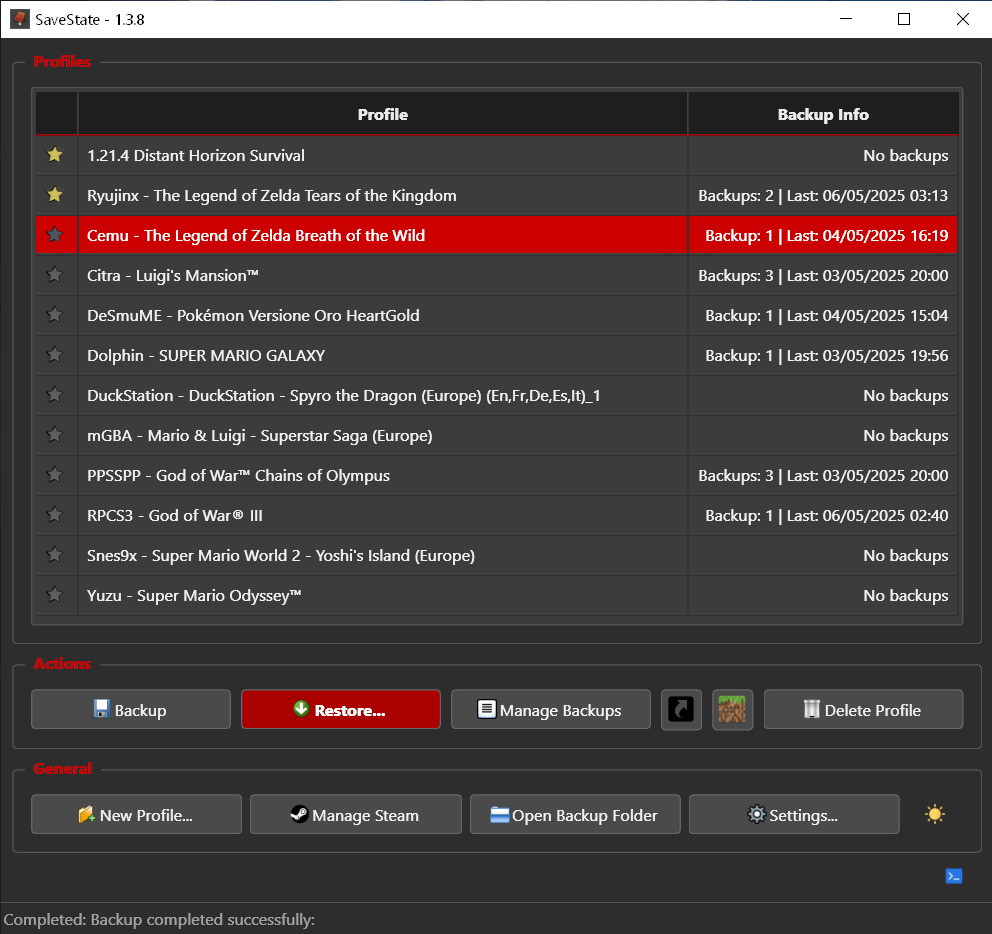
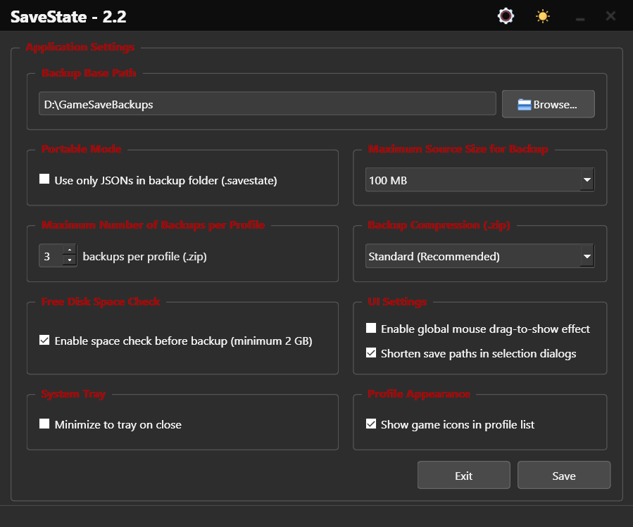

# Usage

> **First launch?** The app works immediately with sensible defaults. You can optionally customize settings, but it's not required.

1. **Launch** `SaveState.exe` (or the AppImage / `python main.py` if running from source).
2. **Configure Settings (Optional):** Click the Settings button to customize the Base Backup Path (defaults to a `SaveState_Backups` folder). You can also adjust max backups, compression, etc. — defaults work fine for most users.
3. **Add Profiles:**
   * **Drag & Drop (Recommended):** Drag any game shortcut (`.lnk`, `.url`, `.desktop`) from your Desktop or launcher onto the main window. SaveState will detect the game and automatically search for its save location.
   * **Multi Profile:** Drop a folder containing multiple games onto the main window. You can review, filter, and add all detected profiles at once.
   * **Steam:** Click **Manage Steam** to see your installed Steam games. Select a game and click Configure — SaveState will automatically detect the save path for most titles.
   * **Minecraft:** Click **New Profile...** and select **"Select from Minecraft World..."** to choose a world directly. A profile will be created using the world name and folder path.
   * **Manual Entry (Fallback):** If automatic detection fails, click **New Profile...**, enter a name, and provide the full path to the game's save folder manually.
4. **Manage Profiles:**
   * Select a profile in the list.
   * Click **Backup** to back it up.
   * Click **Restore** to restore from a previous backup.
   * Click **Manage Backups** to view and delete specific backup archives for that profile.
   * **Right-click** on a profile to access the context menu: edit profile settings or create a desktop shortcut for quick backups.
   * To delete a profile, select it and click the **trash icon** that appears on the right (this does not delete existing backup files).
5. **Other Actions:**
   * Use **Open Backup Folder** to quickly open the base backup location in your file manager.
   * Double-click a profile to **open** the **save path** in your file manager.
   * Toggle the **Log Console** visibility using the terminal icon button.
   * Toggle the **Theme** using the sun/moon icon button.

## Supported Launchers

SaveState works with any launcher via drag & drop of shortcuts. Extra integration exists for:

| Launcher | Notes |
|----------|--------|
| **Playnite** | Open-source library manager that unifies all your games |
| **Heroic Games Launcher** | Open-source launcher for Epic, GOG, and Amazon Games |
| **Steam** | Built-in **Manage Steam** dialog for installed games |

Also works with Epic Games, GOG Galaxy, Battle.net, Ubisoft Connect, EA App, and more — drop the game shortcut onto SaveState.

## UI reference

